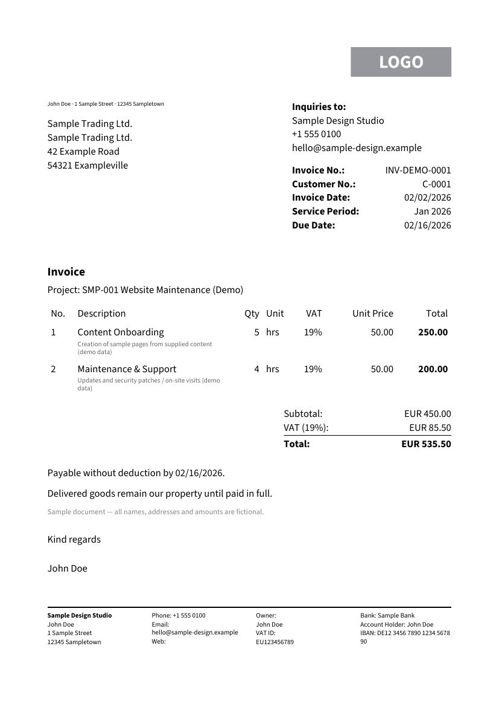
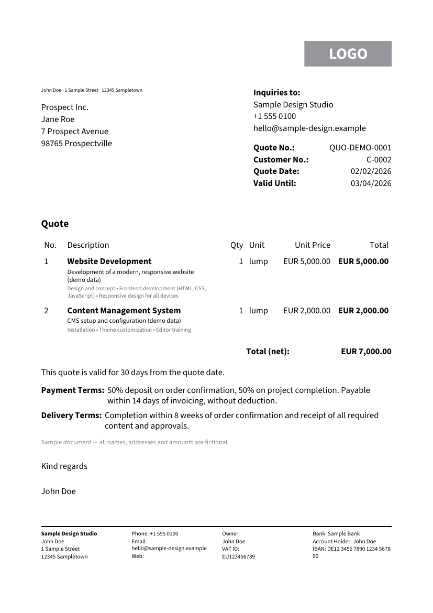
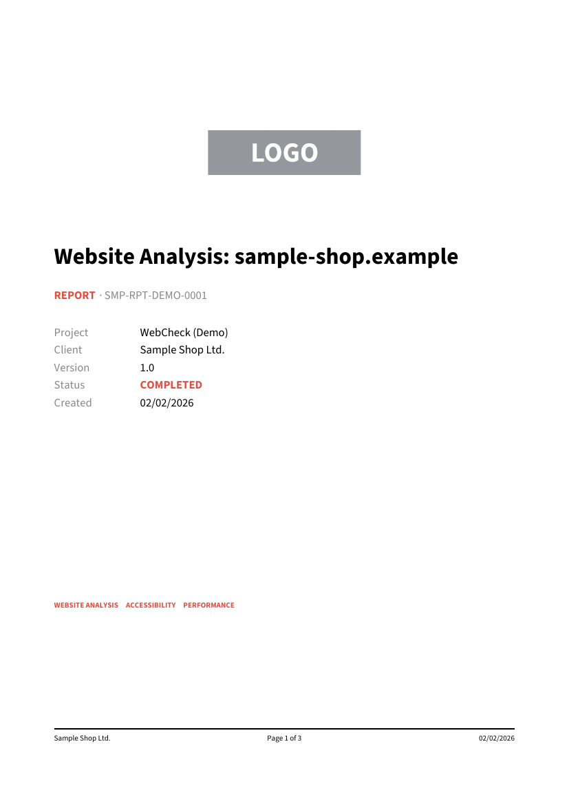

# lightweight-pdf

Lightweight, document-oriented PDF generation in pure Rust — for recurring
business documents (invoices, quotes, delivery notes, reports,
certificates), runnable as `wasm32-unknown-unknown` inside a Cloudflare
Worker. No generic typesetting system, no parser for a custom markup
language — a builder pattern over a fixed set of layout primitives.

Own PDF writer (objects/xref/streams) and own TrueType subsetter; the only
required external dependency is `skrifa` for font parsing. `miniz_oxide`
(FlateDecode compression, see above) is an optional dependency behind the
default-on `compress` feature.

## Example

```rust
use lightweight_pdf::*;

let mut doc = Document::new(PageFormat::A4)
    .margin(Margin::all(20.0))
    .footer(Footer::new(20.0, |ctx| {
        Text::new(format!("Page {} of {}", ctx.page, ctx.total_pages)).into()
    }));

doc.add(Text::new("Invoice").heading1());
doc.add(
    Table::new()
        .columns([TableColumn::flex(1.0), TableColumn::fixed(60.0).align(Align::End)])
        .header(["Item", "Amount"])
        .rows(vec![vec![Element::from("Consulting"), Element::from("1,200.00 USD")]]),
);

let bytes = doc.render().expect("render should succeed");
std::fs::write("invoice.pdf", bytes).unwrap();
```

More complete examples: `crates/lightweight-pdf/examples/invoice.rs` (a
German DIN-5008-style invoice with a multi-page table) and
`.../examples/report.rs`. `examples/demo_*.rs` at the repo root are further,
English-language sample documents (invoice, quote, credentials hand-off,
concept, API documentation, audit report, a custom-font demo, a PDF/A-3b
conformance demo, a ZUGFeRD/Factur-X demo, and a Tagged PDF/PDF-UA demo)
— run with `cargo run -p lightweight-pdf --example demo_invoice` etc.

Page 1 of three of those demos, rendered — regenerate with
`scripts/render-readme-previews.sh` whenever their output changes:

<p>
  
  
  
</p>

## Comparison

Checked directly against each project's own README/crates.io page in
August 2026 (not from memory) — dates and version numbers below are as
of then. Numbers not published anywhere are marked "not measured/published"
rather than guessed.

| | Layout & pagination | WASM | Wasm/binary size | Dependencies | Fonts/subsetting | Images | License | Maintenance |
|---|---|---|---|---|---|---|---|---|
| **lightweight-pdf** (this project) | Own layout primitives + automatic, page-count-stable pagination (two-pass) | First-class target, CI-tested | ~1.2 MiB / ~590 KiB gzip (`wasm` + `default-fonts` + `compress`, [measured](examples/worker/README.md)) | 1 required (`skrifa`); no `image`/GUI/shaping stack | Own TrueType subsetter, only used glyphs embedded | JPEG passthrough, PNG decode+re-embed (feature-gated) | MIT | Active (this repo) |
| [printpdf](https://github.com/fschutt/printpdf) | Added a basic layout system (incl. automatic page-breaking) on top of a lower-level API | Yes, documented, with a hosted demo | Not measured/published | 24 direct deps, incl. a GUI layout engine (`azul-*`) and `image` | Font shaping via `allsorts`; auto-subsetting on save | Via `image` crate | MIT | Active — v0.12.7, last published 2026-08-29 |
| [genpdf](https://git.sr.ht/~ireas/genpdf-rs) | Layout on top of an old printpdf + rusttype pairing | Not documented | Not measured/published | Depends on a printpdf/rusttype pairing from 2021 | Via rusttype | Via printpdf | Apache-2.0 OR MIT | Unmaintained — v0.2.0, last published 2021-06-17 |
| [Typst](https://github.com/typst/typst) | Full typesetting system with its own markup language — not a document-tree API | The web app compiles to WASM; not primarily built as an embeddable library for "call a function, get PDF bytes" | Reported WASM builds run tens of MiB | Large compiler: own layout/math engine, font shaping | Full shaping/subsetting | Full raster/vector support | Apache-2.0 | Active |
| [krilla](https://github.com/LaurenzV/krilla) / [pdf-writer](https://github.com/typst/pdf-writer) | None — krilla's own docs list "text layouting, tables, page breaking, headers/footers" as explicitly out of scope; pdf-writer is lower-level still | Not documented (pure Rust, plausible) | Not measured/published | 23 direct deps (krilla) | Full text shaping (rustybuzz/skrifa) | Full raster/vector support | MIT OR Apache-2.0 | Active — krilla v0.8.2, last published 2026-06-04 |
| Headless Chrome / wkhtmltopdf | Full HTML/CSS layout via a real browser/WebKit engine | No — needs a native browser binary, not a wasm target | Chromium alone is hundreds of MiB | A whole browser | Whatever the OS/browser provides | Full | Chromium: BSD-style. wkhtmltopdf: LGPLv3 | Headless Chrome: active. wkhtmltopdf: [abandonware, archived since Jan 2023](https://github.com/wkhtmltopdf/wkhtmltopdf) |

Where this project is behind, honestly: krilla already ships Tagged PDF/
PDF-UA and PDF/A-1/2/3/4 conformance out of the box — this repo doesn't
yet (tracked, open: PDF/A-3b and Tagged PDF/PDF-UA). And every HTML-based
approach (Typst's own language included) accepts far richer input than
this project's fixed JSON/builder document tree — there's no way to hand
this project arbitrary HTML/CSS or a full typesetting language and get a
sensible result; that's a deliberate scope boundary, not an oversight,
but it's a real limitation if that's what you need.

## CLI (`lwpdf`)

No Rust code needed: `cargo install --path crates/lightweight-pdf-cli`
(or, once published, `cargo install lightweight-pdf-cli`) installs a
`lwpdf` binary that renders the JSON document/template format above.

```sh
lwpdf render examples/invoice-template.json --data examples/invoice-data.json -o invoice.pdf
lwpdf validate examples/invoice-template.json --data examples/invoice-data.json  # parse only, no PDF
lwpdf fonts                                                                       # list default font weights
```

Diagnostics (layout warnings, parse errors) go to stderr. Exit codes: `0`
success, `1` the input was valid but rendering itself failed (e.g. a
missing font weight), `2` an input problem (missing file, malformed
JSON, an unresolved template placeholder). `--allow-missing` on
`render`/`validate` resolves a missing placeholder to an empty string
instead of failing (see `MissingPlaceholder` above). Own crate
(`lightweight-pdf-cli`) so the library itself never depends on `clap`.
`lwpdf schema` prints the document/template JSON Schema (generated from
the Rust types, see the npm package below).

## npm package (`@casoon/lightweight-pdf`)

The Rust engine compiled to WASM with `wasm-bindgen` bindings, for
JS/TS callers with no Rust toolchain — Node.js and edge runtimes
(Cloudflare Workers, ...), no native dependencies:

```ts
import { render } from "@casoon/lightweight-pdf";

const bytes = await render({
  page_format: "A4",
  children: [{ type: "text", content: "Hello from JS" }],
});
```

`Document` (the type above) is generated from the same JSON Schema
`lwpdf schema` prints — not hand-maintained. See `bindings/js/README.md`
for the full API (diagnostics, font registration) and how to build the
package from source. Published from `.github/workflows/release-npm.yml`,
a tag-triggered release job only — never part of the PR path, which
already proves the bindings compile via the existing `wasm-size` CI job.

## Cloudflare Worker starter

`examples/worker/` is a deployable-in-five-minutes Worker: `POST` a JSON
document, get a PDF back. Measured module size and cold-start/render
timings (via `wrangler dev`/`deploy --dry-run`) are in its own README —
that's exactly the numbers this crate's target audience decides on.

## Browser playground

`examples/playground/` is a static Astro site — JSON editor on the left,
PDF preview on the right (the browser's own PDF viewer, via a `blob:`
URL), rendered entirely client-side through the wasm build, no backend.
Pick one of the built-in templates (invoice/offer/report/docs), edit the
JSON, and share the result via a URL-encoded link. See its own README to
run it locally.

## Size & performance

Tracked continuously in CI (`wasm-size` job, job summary of every run on
`master`) rather than a one-off measurement — a regression gate compares
each run's gzip size against `.github/wasm-size-baseline.json` and fails
the job if it grows more than the documented tolerance without the
baseline being updated in the same commit.

- **WASM module (shipped, `@casoon/lightweight-pdf` npm package, `wasm`
  + `default-fonts` + `compress`):** 1252.95 KiB raw / 590.37 KiB gzip
  — measured via `wrangler deploy --dry-run`'s own upload-size report,
  see `examples/worker/README.md`.
- **Render throughput (native release build, average of 5 runs each):**
  ~4 ms/document for the invoice/offer/report demos. Native, not wasm —
  see `examples/worker/README.md` for measured cold-start (~34–47 ms)
  and warm (~11–25 ms) numbers in an actual `workerd` runtime.
- **Output PDF size** (same three demos, `compress` on by default):
  ~24–26 KB each.

## Features

- Layout primitives: `Text`, `Column`, `Row`, `Table`, `List`, `Image`,
  `Line`, `Spacer`, `PageBreak` — with `flex`, alignment (including
  `Align::Justify` for `Text`: every line flush with both edges except a
  paragraph's last), padding, border/background, rounded corners
  (`.corner_radius()`), and dashed borders (`Border::dashed(width, color,
  dash, gap)`).
- Page formats `A3`/`A4`/`A5`/`Letter`/`Legal`/`Custom(w, h)` plus
  `Document::landscape()`/`.portrait()` orientation.
- Document metadata (title/author/subject/keywords/creator/creation date/mod
  date) written to the PDF `/Info` dictionary via `Document::title()`/`.author()`/
  `.creation_date(PdfDate::new(..))`/etc., plus a `/Producer` and a
  deterministic `/ID` (hashed from document content, never a random source)
  on every document.
- Hyperlinks: `Text::url(...)` emits a PDF URI link annotation over the
  rendered text; `Text::anchor(name)`/`.link_to(name)` do the same for
  internal jumps (e.g. a table of contents entry to a heading elsewhere
  in the document), resolved to a `/Dest` once pagination is final.
- PDF bookmarks (`/Outlines`): `.heading1()`/`.heading2()`/`.heading3()`
  build the sidebar tree automatically (`.outline_level(n)` for anything
  else that should show up in it); a document with no headings emits no
  `/Outlines` object at all.
- `TableOfContents::new()`: self-populates from every heading
  (`.heading1()`/`2`/`3`/`.outline_level(n)`) in the document, in order,
  with correct page numbers and a clickable entry per heading — the
  two-pass layout already runs (for `{page}/{total}` in Header/Footer)
  determines those before this element ever renders. `.max_depth(n)`
  limits which heading levels become entries (default `3`), `.leader(c)`
  sets the fill character between title and page number (default `.`,
  `' '` for none). Splits across pages like any other content if it has
  enough entries.
- JSON documents (`serde` feature): `Document::from_json(&str)`/`.to_json()`
  (de)serialize the whole document tree — `serde_json::from_str::<DocumentSchema>`/
  `to_string` also works directly for other formats via the same
  `#[derive(Deserialize)]` (YAML/TOML, bring your own crate). The root is
  versioned (`{"schema_version": 1, "document": {...}}`); unknown fields
  anywhere in the tree are a parse error, never silently dropped. Every
  `Element` is tagged by a `"type"` field (`"text"`, `"table"`, ...); see
  `examples/document.json`. Deliberately no scripting/expressions/loops —
  a serialization format, not a template language. Not representable in
  JSON: `Header`/`Footer` (Rust closures) — `to_json()` refuses outright
  if either is set rather than silently dropping them. `Image` embeds as
  base64 (`{"bytes_base64": "...", "common": {...}}`).
- Data-driven templates (`serde` feature, builds on the above):
  `Document::from_template(template_json, data_json, MissingPlaceholder)`
  resolves `"{{path.to.value}}"` placeholders in a template document
  against a separate data document, no Rust code needed — a placeholder
  that's the *entire* string value resolves to the data's own JSON type
  (a number stays a number); embedded in more text it's always a string.
  A missing path is a clear error by default, or an empty string with
  `MissingPlaceholder::Empty`. Row/list repetition is a JSON construct,
  not a text marker: `{"$each": "items", "template": <value>}` wherever
  it appears as an array element expands to one copy of `template` per
  element, with the element's own fields resolved before falling back to
  the outer data — deliberately array-iteration only, no conditions, no
  expressions, no filters. `render_template()` alone (without a
  `Document`) also works, for other consumers of the same JSON schema.
  See `examples/invoice-template.json` + `examples/invoice-data.json`.
- Content streams, embedded font programs, and raw image samples are
  `/FlateDecode`-compressed by default (`compress` feature, on unless
  explicitly disabled) — typically 40-60% smaller output.
- `Document::theme(Theme { .. })`: named style roles (`body`, `caption`,
  `heading1`/`2`/`3`, `table_header`, `muted`) resolved once, when an
  element is added — no cascade. `Text::new()` and the `.heading1()`/`.heading2()`/
  `.heading3()`/`.caption()`/`.muted()`/`.table_header()` presets are
  theme-eligible until any other style call (`.size()`, `.color()`, ...)
  opts them back out; `.align()` is independent of theming either way.
  Table header cells built from plain strings (`Table::header(["A", ...])`)
  pick up `table_header` automatically. No `.theme(..)` call means
  unchanged output.
- Hyphenation: a soft hyphen (U+00AD) anywhere in `Text::new(..)`'s content
  marks an optional break point — used (as a visible `-`) only if the line
  actually needs it there, invisible and absent from extracted text
  otherwise; a hyphenated prefix is preferred over leaving a ragged gap
  and moving the whole word down. `Text::hyphenate(HyphenationLanguage)`
  additionally inserts these break points automatically from Knuth-Liang
  patterns (English/US, German) — requires the `hyphenation` feature (see
  below; substantially increases binary/WASM size, off by default).
- `Text::rich([Span::new("...", style), ...])`: multiple styles (font/size/
  color) inside one text element, wrapped and paginated as a single
  paragraph — mixed sizes on one line share that line's baseline (from the
  tallest word), and a page split can land in the middle of a span. Not
  supported for rich text: `Align::Justify`, `.url()`/`.link_to()`/
  `.outline_level()`.
- Automatic, page-count-stable pagination (two-pass) including
  header/footer bands, widow/orphan rule, and `keep_with_next`.
- Tables that split across page boundaries (header repeats automatically)
  with row striping; cells support `colspan`/`rowspan` and a per-cell
  background/border/padding/alignment override via `TableCell` (cell beats
  row beats column). A `rowspan` never splits across a page break — the
  whole span moves to the next page together.
  `Table::from_rows(&items)` builds rows from anything implementing
  `TableRow` instead of hand-nesting `vec![vec![Element::from(..), ...]]`.
- Own TrueType subsetting (only glyphs actually used are embedded) for
  real Unicode text via Type-0/CIDFontType2; a Source Sans 3 regular/bold
  pair is bundled by default (`default-fonts` feature). `FontRegistry` is a
  dynamic, arbitrary-`FontKey` registry (`register()`/`register_named()`),
  not fixed to two weights — bring your own fonts via
  `FontRegistry::with_fonts(regular_bytes, bold_bytes)` +
  `Document::render_with_fonts()` (works without `default-fonts` too, see
  `examples/demo_custom_font.rs`), or register additional weights such as
  `FontKey::SANS_ITALIC`/`SANS_BOLD_ITALIC` yourself — `default-fonts`
  bundles regular/bold only, no italic. `Text::italic()`/`.bold_italic()`
  render as italic once a font is registered under that key; with no such
  registration, `render()`/`render_with_diagnostics()` return
  `RenderError::MissingFont` instead of silently substituting the
  registry's default font.
- Images: JPEG is passed through unchanged as `DCTDecode`; PNG is decoded
  and re-embedded with a separate `SMask` (alpha channel) — only with the
  `png` feature enabled (see below).
- Watermarking as a document-level feature (rotated, repeated text drawn
  beneath the page content) — deliberately no general transform/rotation
  API.
- `Document::pdf_a3b()` (`pdf-a` feature): PDF/A-3b-conformant output —
  XMP metadata kept in sync with `/Info`, `/OutputIntent` with an
  embedded sRGB ICC profile, and a transparency-group colour space for
  any page with an alpha-channel image. Verified against the [veraPDF](https://verapdf.org/)
  validator, both locally and in CI (`pdf-a-conformance` job, against
  `examples/demo_pdf_a3b.rs`); without the feature, calling it makes
  `render()` return `RenderError::PdfAFeatureDisabled` instead of
  silently producing non-conformant output.
- `Document::zugferd_xml(bytes)` (`zugferd` feature, implies `pdf-a`):
  embeds a caller-supplied EN 16931 ZUGFeRD/Factur-X invoice XML as an
  associated file (`/AF`, `/Names/EmbeddedFiles`, the Factur-X XMP
  extension schema) — this crate embeds only, it never generates or
  validates that XML (ADR-018). Verified against both veraPDF (PDF/A-3b
  container) and the [Mustang](https://www.mustangproject.org/) reference
  validator (PDF *and* the embedded XML against EN 16931), see
  `examples/demo_zugferd.rs`.
- `Document::pdf_ua()` (`tagged-pdf` feature, implies `pdf-a` — ADR-019):
  Tagged PDF/PDF-UA-1 output — a real structure tree (`/StructTreeRoot`,
  one `/StructElem` per heading/paragraph/table row+cell/list item/
  figure), marked content (`BDC`/`EMC` with MCIDs) in every content
  stream, `/Lang`, and the watermark/header/footer marked as artifacts
  (pagination decoration, excluded from reading order) rather than
  structure. `Image::alt(text)` sets `/Alt`; without it, `/Alt` is still
  written (empty, so the structure tree stays well-formed) but
  `render_with_diagnostics()` reports a warning — and the file genuinely
  isn't PDF/UA-1-conformant until real alt text is supplied, verified
  against veraPDF (this crate won't invent placeholder text). Verified
  against veraPDF's `ua1` profile (and `3b`, since `pdf_ua()` implies
  `pdf_a3b()`), both locally and in CI (`pdf-a-conformance` job, against
  `examples/demo_pdf_ua.rs`).

## Cargo features (crate `lightweight-pdf`)

| Feature           | Default | Purpose                                                       |
|--------------------|:-------:|-----------------------------------------------------------------|
| `default-fonts`     | ✅      | Bundles Source Sans 3 as the default font set for `Document::render()`/`render_with_diagnostics()`. Not needed for `render_with_fonts()` (custom fonts) — `--no-default-features` still compiles the `lib` target and the `demo_custom_font` example, just not the other examples/tests, which call `render()` directly. |
| `compress`          | ✅      | `/FlateDecode`-compresses content streams, embedded font programs, and raw image samples (`miniz_oxide`, see ADR-016). Disabling it falls back to the previous always-uncompressed output — same PDFs, just bigger. |
| `png`               |         | PNG decoding/embedding (`Image::from_png`); without this feature, embedding a PNG fails at runtime with `ImageEmbedError::PngFeatureDisabled`. |
| `hyphenation`       |         | Automatic Knuth-Liang hyphenation (`Text::hyphenate(HyphenationLanguage)`), English/US and German. Pulls in the `hyphenation` crate with all its bundled language dictionaries (no per-language embedding is available upstream), which roughly quadruples release/WASM binary size — measured and not recommended for tight WASM size budgets; see `plan/progress.md`. Soft-hyphen (U+00AD) breaking itself needs no feature and is always on. |
| `serde`             |         | `Document::from_json()`/`.to_json()` (`serde`, `serde_json`, `base64` for `Image`). See the Features list above for schema scope/limitations. |
| `schemars`          |         | Generates a JSON Schema for the document/template format (`schemars`; implies `serde`) — what `lwpdf schema`/the npm package's generated TypeScript types are built from. |
| `wasm`              |         | Targets `wasm32-unknown-unknown` with `wasm-bindgen` JS bindings (implies `serde`) — see the npm package section above. |
| `wasm-size-probe`   |         | Internal, non-public `extern "C"` function used to measure WASM build size (CI); requires `default-fonts`. |
| `pdf-a`             |         | `Document::pdf_a3b()`: PDF/A-3b-conformant output (XMP metadata synced with `/Info`, `/OutputIntent` with an embedded sRGB ICC profile, transparency-group colour space) — verified against the official `verapdf` validator, see below. Costs ~4.3 KiB gzip (measured, `wasm-size` config): the embedded profile is the ICC Consortium's own 3 KiB reference `sRGB2014.icc`, not the "several hundred KB" a full CMYK/ICC-v4 profile can run — the fear that motivated gating this behind a feature at all turned out not to apply here. |
| `zugferd`           |         | `Document::zugferd_xml(bytes)`: embeds a caller-supplied EN 16931 invoice XML as a ZUGFeRD/Factur-X associated file (implies `pdf-a`). Embedding only — this crate never generates or validates the XML itself, see ADR-018 in the local `plan/00-decisions.md`. |
| `tagged-pdf`        |         | `Document::pdf_ua()`: Tagged PDF/PDF-UA-1 output — structure tree, marked content, `/Lang`, artifact-marked watermark/header/footer (implies `pdf-a`, ADR-019 in the local `plan/00-decisions.md`). |

## Workspace

```
crates/
  lightweight-pdf-core/         Document model, elements, builder API
  lightweight-pdf-layout/       Layoutable trait, pagination, text wrapping
  lightweight-pdf-writer/       PDF writer core (objects, xref, streams, fonts)
  lightweight-pdf-fonts/        Font metrics/parsing (skrifa), subsetting
  lightweight-pdf/              Facade crate, public API + wasm feature
  lightweight-pdf-cli/          `lwpdf` binary: render/validate JSON documents
                                 and templates from the command line, no Rust
                                 code needed. Its own crate so `clap` never
                                 becomes part of the library's dependency tree.
  lightweight-pdf-testing/      Pixel-diff PDF snapshot testing (render →
                                 pdftoppm → compare against a reference PNG) —
                                 usable standalone for your own PDF templates,
                                 not just this library's.
  lightweight-pdf-test-support/ Internal (publish = false): shared qpdf/pdftotext
                                 shell-out helpers for lightweight-pdf's integration
                                 tests, a dev-dependency only.
bindings/
  js/                            `@casoon/lightweight-pdf` npm package (wasm-bindgen
                                  + generated TypeScript types), see its own README.
```

Dependency direction is strictly one-way: `core ← layout ← facade`;
`writer` and `fonts` are leaves with no path dependency on `core`/`layout`
(enforced in CI via `cargo tree`).

Architecture, decisions (ADRs) and the work plan live locally in `plan/`
(not part of this repo/its history).

## Building & testing

```sh
cargo test --workspace                          # unit + integration tests
cargo test -p lightweight-pdf --features png     # incl. PNG path
cargo clippy --workspace --all-targets -- -D warnings
cargo build --workspace --target wasm32-unknown-unknown --release
```

`crates/lightweight-pdf/tests/snapshots.rs` pixel-diffs a handful of
representative documents (table+theme, image+watermark, multi-page
list/TOC) against low-DPI grayscale reference PNGs in
`test-fixtures/snapshots/` via `lightweight-pdf-testing`
(`pdftoppm`-based, no extra system dependency). After an intentional
visual change, regenerate the references:

```sh
UPDATE_SNAPSHOTS=1 cargo test -p lightweight-pdf --test snapshots
```

`lightweight-pdf-testing` itself works standalone on any PDF, not just
ones built with this library — see its own doc comment.

## Publishing

All five published workspace crates (everything except the internal,
`publish = false` `lightweight-pdf-test-support`) are live on crates.io.
They share one workspace version (`workspace.package.version`), so a
release bumps all five together, even if only one crate actually changed —
simpler than tracking independent versions for a one-way dependency chain
this shallow. Path dependencies between them carry a matching `version`
requirement, as `cargo publish` requires.

Because `lightweight-pdf-layout` and `lightweight-pdf` depend on sibling
crates, a release must publish in dependency order — each step only works
once the previous one is live on crates.io (crates.io's index needs a
moment to catch up after each publish; retry the next step if it fails
immediately with "no matching package found"):

```sh
cargo publish -p lightweight-pdf-writer
cargo publish -p lightweight-pdf-core
cargo publish -p lightweight-pdf-fonts
cargo publish -p lightweight-pdf-layout   # needs lightweight-pdf-core live
cargo publish -p lightweight-pdf          # needs all four live
```

## License

The crate code (all workspace members) is MIT-licensed, see `LICENSE`.

The bundled default fonts (Source Sans 3) are under the SIL Open Font
License 1.1 — license text in `assets/fonts/LICENSES/`. The OFL permits
embedding/subsetting in generated documents, so the generated PDFs are not
subject to any OFL obligation.
